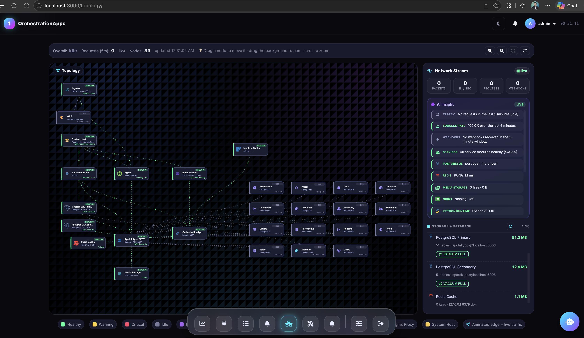

# ApotekMonitor v1.0.0



Observability & orchestration dashboard for [ApotekApps](https://github.com/harys-rifai/ApotekApps) — monitors endpoint health, request logs, webhook events, latency, and business success rate, plus a **realtime infrastructure topology** (Dynatrace-style smartscape) with a **live network stream**, **WAF & Ingress monitoring**, **PostgreSQL secondary** support, and **email monitoring**.

---

## Overview

| Dashboard | Topology · Smartscape | Config | Maintenance | Endpoints | Logs |
|-----------|----------------------|--------|-------------|-----------|------|
| KPI cards, charts, tables | Node + edge map with live network stream, WAF & Ingress nodes | DB / Redis / AI / Email | SQLite · PostgreSQL (Primary + Secondary) · Redis | Endpoint list + ping | Filter & pagination |

---

## Features

- **Realtime Dashboard** — KPI cards (total, success, fail, error, success rate, avg latency)
- **Request Volume Chart** — stacked bar per day (7 / 14 / 30 days)
- **Status Distribution** — donut chart success vs fail vs error
- **Latency Chart** — line chart of average response time per day
- **Top Endpoints Table** — most-called endpoints ranking + pagination
- **Slowest Endpoints** — endpoints with the highest average latency
- **Topology · Smartscape** — Dynatrace-style map of infrastructure nodes (**PostgreSQL Primary**, **PostgreSQL Secondary**, Redis, Media, Nginx, Python Runtime, System Host, WAF, Ingress, ApotekApps REST API, OrchestrationApps, **Email Monitor**), per-module microservices, and a loyalty **Member** node (member count & poin), with edges representing relationships & traffic. Nodes use brand-accurate icons (PostgreSQL, Redis, SQLite, Nginx) and auto-fit on first load, preserving manual drag positions.
- **Live Network Stream** — *real-time* network traffic via Server-Sent Events (SSE). Every new API request or webhook spawns a "packet" that travels along the matching topology edge, with a side feed panel (pkts, pkts/s, requests, webhooks).
- **Email Monitoring** — dedicated **Email Monitor** topology node probing the SMTP server, plus an **Email Monitoring** side panel (live status + test-email button) and a **Config → Email (ApotekApps)** card that auto-reads SMTP config (host, port, user, TLS, from) from ApotekApps `/api/common/system-status/` & `/api/common/system-config/`.
- **Storage & Database Panel** — live sizes for Monitor SQLite, ApotekApps PostgreSQL (Primary + Secondary), and Redis.
- **Database Maintenance** — one-click maintenance on each store via `/maintenance/`: SQLite **VACUUM**, PostgreSQL **VACUUM FULL / VACUUM ANALYZE / REINDEX / ANALYZE / Backup** (run on Primary **and** Secondary), and Redis **FLUSHDB** (each action opens in autocommit mode so it works outside a transaction block).
- **AI Insight** — auto-generated infrastructure insights (every 60s) plus an AI chat assistant (OpenAI-compatible router).
- **Brand Icons** — nodes use accurate brand SVGs (PostgreSQL, Redis, SQLite, Nginx via official Simple Icons paths; others via Font Awesome), all rendered at a uniform size without hexagon badges.
- **WAF & Ingress** — dedicated topology nodes + edges (`waf → ingress → nginx → apps_api`) reflecting the deployed reverse-proxy stack; status probed live.
- **Health Probes** — real checks against PostgreSQL (Primary + Secondary), Redis, media storage, Nginx, the Python runtime, System Host, and SMTP (email).
- **Member Monitoring** — loyalty node showing member count & total poin from PostgreSQL.
- **Alerts** — topology status-change notifications (critical / warning / recovered) stored and shown in the navbar.
- **Request Logs** — filter by status, method, path + client-side pagination
- **Webhook Receiver** — `POST /webhook/receive/` to ingest events from external systems
- **Deliveries** — webhook delivery history
- **Endpoint Ping** — one-click direct call to the ApotekApps API
- **Config Page** — manage SQLite, PostgreSQL (ApotekApps replica), Redis, AI Assistant, and read-only Email (ApotekApps) config
- **JWT Auto-Refresh** — tokens managed automatically (login → refresh → re-login)
- **Retry + Rate Limiting** — up to 3 retries with exponential backoff, throttled to 60 req/min
- **Dark Theme** — Neon Dark UI, matching ApotekApps

---

## Requirements

| Software | Version |
|----------|---------|
| Python   | 3.11+   |
| Django   | 4.2.x   |
| requests | 2.32.x  |
| psutil   | 7.2.x   |
| python-decouple | 3.8.x |

> [ApotekApps](https://github.com/harys-rifai/ApotekApps) must be running (default `http://127.0.0.1:8000`) for ping, SMTP-config reading, probing, and monitoring to work.

---

## Installation

```bash
# 1. Clone repo
git clone https://github.com/harys-rifai/ApotekMonitor.git
cd ApotekMonitor

# 2. Copy configuration
cp .env.example .env

# 3. Run (auto-creates venv, installs deps, migrates, creates admin)
sh run.sh
```

Server runs at **http://127.0.0.1:8090**

---

## Configuration `.env`

```env
SECRET_KEY=change-me-to-a-safe-secret-key
DEBUG=True
ALLOWED_HOSTS=*

# ApotekApps API base URL (no trailing slash)
APOTEK_API_BASE_URL=http://127.0.0.1:8000/api

# Credentials used to obtain an ApotekApps token for monitoring
APOTEK_ADMIN_USERNAME=admin
APOTEK_ADMIN_PASSWORD=admin
```

> Email/SMTP configuration is **not** stored here — it is read automatically from ApotekApps (`/api/common/system-status/` & `/api/common/system-config/`).
>
> PostgreSQL Primary / Secondary connection is read from `ApotekApps/.env` (`DB_*` / `STANDBY_DB_*`), with optional overrides on the **Config** page.

---

## Default Login

| Field    | Value   |
|----------|---------|
| Username | `admin` |
| Password | `admin` |

Login at **http://127.0.0.1:8090/login/**

---

## Project Structure

```
ApotekMonitor/
├── apps/
│   ├── accounts/          # Login / logout (also accepts ApotekApps credentials)
│   └── monitor/
│       ├── models.py      # NodeLayout, AiInsight, APIEndpoint, APIRequestLog,
│       │                  #   Alert, WebhookEvent, AIConfig, ConnectionConfig, AIChatLog
│       ├── services.py    # HTTP client (JWT, retry, rate-limit)
│       ├── views.py       # Dashboard, logs, ping, stats, topology, network
│       │                  #   stream, webhook, email monitor, config, AI,
│       │                  #   DB maintenance (SQLite/PG/Secondary/Redis)
│       ├── urls.py
│       ├── ai_insight.py  # Infrastructure insight generator
│       ├── ai_chat.py     # AI chatbot caller
│       └── management/commands/
│           ├── seed_endpoints.py   # Populate ApotekApps endpoints
│           ├── seed_fake.py         # Generate dummy data for demos
│           ├── simulate_traffic.py  # Emit live traffic for the network stream
│           ├── sync_to_postgres.py  # Backup sync SQLite → PostgreSQL
│           ├── db_backup.py         # Emergency snapshot backup
│           ├── db_check.py          # DB health check
│           └── db_restore.py        # Restore from snapshot
├── config/
│   ├── settings.py
│   └── urls.py
├── templates/
│   ├── base.html
│   ├── accounts/login.html
│   ├── monitor/
│   │   ├── dashboard.html
│   │   ├── endpoints.html
│   │   ├── endpoint_detail.html
│   │   ├── topology.html
│   │   ├── db_maintenance.html
│   │   ├── config.html
│   │   ├── webhooks.html
│   │   ├── alerts.html
│   │   └── deliveries.html
│   └── partials/
│       ├── sidebar.html
│       └── navbar.html
├── static/
│   ├── css/
│   │   ├── theme.css      # Neon dark theme (shared with ApotekApps)
│   │   └── main.css       # ApotekMonitor-specific components
│   └── js/main.js
├── manage.py
├── requirements.txt
├── run.sh
├── push.sh
└── .env.example
```

---

## Pages & URLs

| URL | Description |
|-----|-------------|
| `/` | Main dashboard |
| `/endpoints/` | All endpoints + ping |
| `/endpoints/<id>/` | Endpoint detail + log history |
| `/logs/` | All request logs (filter + pagination) |
| `/topology/` | Topology smartscape + live network stream + email monitoring |
| `/maintenance/` | SQLite / PostgreSQL (Primary + Secondary) / Redis maintenance actions |
| `/config/` | Connection & AI config (email read from ApotekApps) |
| `/webhooks/` | Received webhook events |
| `/alerts/` | Alert / notification history |
| `/deliveries/` | Webhook delivery history |
| `/api/ping/<id>/` | Ping endpoint (JSON) |
| `/api/stats/` | Chart data (JSON) |
| `/api/activity/` | Recent activity for topology animation (JSON) |
| `/api/topology/` | Topology nodes & edges (JSON, includes `infra.email`) |
| `/api/db-sizes/` | Storage & database sizes — SQLite, PostgreSQL Primary + Secondary, Redis (JSON) |
| `/api/email/` | Email monitor status (`?test=1` sends a test email via ApotekApps SMTP) |
| `/api/ai-insight/` | AI infrastructure insight (JSON) |
| `/api/ai-chat/` | AI chat assistant (JSON) |
| `/api/config/save/` | Save connection/AI config |
| `/api/config/apotek-email/` | Email config mirrored from ApotekApps (JSON) |
| `/api/network/stream/` | **Live network stream (SSE)** |
| `/api/alerts/` | Alerts + unread count (JSON) |
| `/api/db-vacuum/` | `VACUUM FULL` on PostgreSQL Primary |
| `/api/db-vacuum-secondary/` | `VACUUM FULL` on PostgreSQL Secondary |
| `/api/db-vacuum-analyze/<db>/` | `VACUUM ANALYZE` (db = `primary` \| `secondary`) |
| `/api/db-reindex/<db>/` | `REINDEX` (Primary \| Secondary) |
| `/api/db-analyze/<db>/` | `ANALYZE` (Primary \| Secondary) |
| `/api/db-backup/<db>/` | `pg_dump` backup (Primary \| Secondary) |
| `/api/db-sqlite-vacuum/` | `VACUUM` on Monitor SQLite |
| `/api/db-redis-flushdb/` | `FLUSHDB` on Redis |
| `/webhook/receive/` | Receive webhook events (POST) |
| `/login/` | Login page |
| `/admin/` | Django admin |

---

## Topology, Live Network Stream & Email Monitoring

The `/topology/` page renders the infrastructure smartscape. Node/edge data is polled every 10 seconds from `/api/topology/`.

Network data is streamed **live** via SSE at `/api/network/stream/`:

- **New API request** → a packet travels along edge `nginx → apps_api` then `apps_api → svc_<module>` (green = success, red = failed).
- **New webhook** → a packet travels along edge `apps_api → monitor` (purple).

The **Network Stream** side panel shows a summary (total packets, packets/sec, requests, webhooks) and a live event feed. The server uses `StreamingHttpResponse` with `text/event-stream` — no extra dependencies. The connection auto-reconnects if it drops.

### Topology layers

The smartscape maps real dependencies between the layers:

```
WAF → Ingress → Nginx → ApotekApps API → PostgreSQL Primary · PostgreSQL Secondary
                                            ↓                (DB)      (replica)
                                         Redis Cache       ↗
                                            ↓
                                      Media Storage
                                            ↓
                                   Python Runtime → System Host
```

- **WAF / Ingress** — front of the stack; probed live and drawn as `waf → ingress → nginx → apps_api`.
- **PostgreSQL Primary (:5006)** and **PostgreSQL Secondary (:5008)** — both probed and sized; the secondary is monitored as a replica edge (`pg_secondary → apps_api`).
- **Member** — loyalty node showing member count & total poin read from PostgreSQL Primary.

### Email Monitoring

The **Email Monitor** node probes the SMTP server configured in **ApotekApps**. Its config is auto-read from ApotekApps:

- `GET /api/common/system-status/` (host + connection state)
- `GET /api/common/system-config/` (full config: host, port, user, `use_tls`, `use_ssl`, from)

The **Email Monitoring** side panel on the topology page reflects live SMTP status and can send a test email (`POST /api/email/?test=1`), which connects to the ApotekApps SMTP server directly using the fetched host/port/TLS. The **Config → Email (ApotekApps)** card shows the same config read-only.

> Note: ApotekApps does not expose the SMTP password via its API, so test emails use the host/port/TLS it provides. If Gmail-style auth is required, configure it in ApotekApps directly.

### Generate live traffic for the demo

To make the network stream active without real user actions, run the traffic simulator (leave it running in a separate terminal):

```bash
python manage.py simulate_traffic            # ~2 events/sec, runs until stopped
python manage.py simulate_traffic --rate 5   # 5 events/sec
python manage.py simulate_traffic --duration 120  # stop after 120 seconds
```

---

## Database Maintenance

`/maintenance/` and the Storage & Database panel offer maintenance for every store. Each PostgreSQL / Redis action opens its own autocommit connection (so `VACUUM FULL` runs outside a transaction block). Actions run against the **Primary** or **Secondary** PostgreSQL as configured in `ApotekApps/.env`.

> ⚠️ `VACUUM FULL` takes an `ACCESS EXCLUSIVE` lock on every table for the whole operation (blocking reads/writes). Run it during a quiet window, or prefer `VACUUM ANALYZE` / `ANALYZE` for routine upkeep.

---

## Seed Data

Populate ApotekApps endpoints into the database:

```bash
python manage.py seed_endpoints
```

Generate dummy logs & webhooks (historical, for charts/dashboards):

```bash
python manage.py seed_fake
```

> Note: `seed_fake` creates *historical* records, so they will not appear in the live SSE stream. Use `simulate_traffic` for live stream activity.

---

## Webhook

Send an event from another system to ApotekMonitor:

```bash
curl -X POST http://127.0.0.1:8090/webhook/receive/ \
  -H "Content-Type: application/json" \
  -d '{"event": "stock_empty", "medicine": "Paracetamol", "qty": 0}'
```

The event is stored in `WebhookEvent` and shown on `/webhooks/`, and it also flows into the live network stream.

---

## Tech Stack

- **Backend** — Django 4.2, SQLite (optional PostgreSQL backup replica)
- **HTTP Client** — requests + urllib3 Retry
- **Auth** — Django session (monitor) + auto-managed JWT (ApotekApps API) + ApotekApps credential login
- **Realtime** — Server-Sent Events (SSE) via `StreamingHttpResponse`
- **Database drivers** — psycopg3 (`psycopg`) with a psycopg2 fallback
- **AI** — OpenAI-compatible router (chat + infrastructure insight)
- **Frontend** — Django templates, Chart.js 4.4, Font Awesome 6.5, vanilla JS (SVG smartscape)
- **Icons** — Simple Icons brand SVGs (PostgreSQL/Redis/SQLite/Nginx) + Font Awesome
- **Theme** — Neon Dark (shared with ApotekApps)

---

## Push to GitHub

```bash
sh push.sh                 # auto commit & push semua perubahan
sh push.sh "pesan commit"  # dengan pesan custom
```

> Remote: `https://github.com/harys-rifai/apotek-api-webhooks-endpoint.git`
